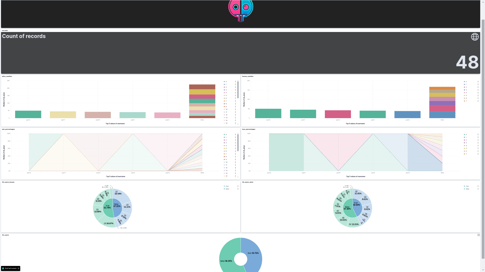
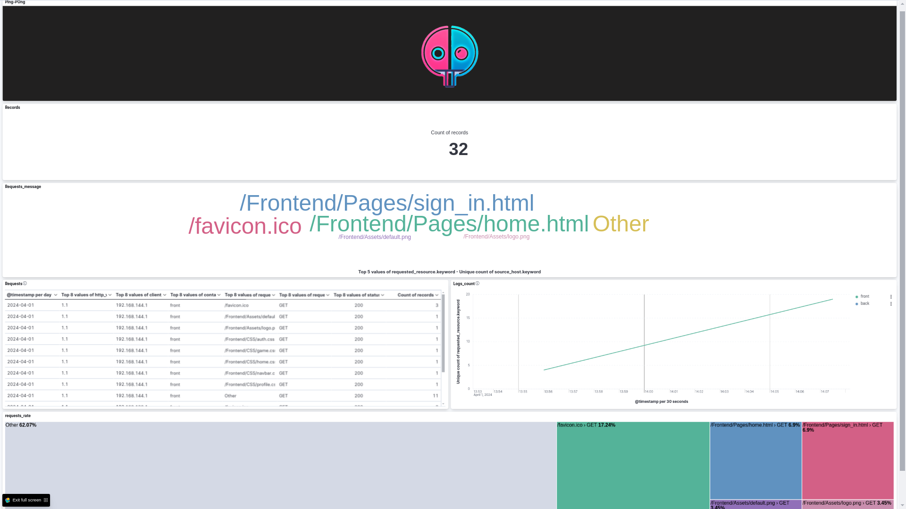

# ELK Stack Setup and Configuration Guide

This guide provides step-by-step instructions for setting up and configuring the ELK (Elasticsearch, Logstash, Kibana) stack, importing dashboards to Kibana using the Kibana API, managing users and roles using scripts, configuring Logstash to ingest data from PostgreSQL and container logs, and viewing parsed logs in the configured dashboard.

## Introduction

The ELK stack is a powerful combination of tools used for log management and analysis. It consists of:

- Elasticsearch: A distributed, RESTful search and analytics engine.
- Logstash: A server-side data processing pipeline that ingests data from multiple sources simultaneously, transforms it, and then sends it to Elasticsearch.
- Kibana: A data visualization and exploration tool for viewing and interacting with data stored in Elasticsearch.

## ELK Stack Setup

Follow these steps to set up the ELK stack:

1. Install Elasticsearch, Logstash, and Kibana according to the official documentation.

2. Configure Elasticsearch and Kibana as needed for your environment.

3. Start Elasticsearch and Kibana services.

4. Verify that Elasticsearch and Kibana are running by accessing their respective URLs in a web browser.

## Importing Dashboards to Kibana

To import dashboards to Kibana using the Kibana API:

1. Download the desired dashboard JSON file(s) from a reliable source or create your own dashboards.

2. Use the Kibana API to import the dashboard JSON file(s). Refer to the Kibana API documentation for details.

## User Management

To manage users and roles using scripts:

1. Use scripts to interact with the Kibana API for user and role management.

2. Create scripts to create, update, and delete users and roles as needed.

## Configuring Logstash

To configure Logstash to ingest data from PostgreSQL and container logs:

1. Install Logstash and any necessary plugins for PostgreSQL and container log parsing.

2. Create Logstash configuration files for each data source (PostgreSQL and container logs). Example configurations can be found in the Logstash documentation.

3. Test each Logstash configuration to ensure data is being ingested correctly.

4. Start Logstash service and monitor its logs for any errors or warnings.

## Parsing Container Logs

To parse container logs with Logstash filters:

1. Use appropriate Logstash filters to parse container logs based on their format. Common formats include JSON, syslog, etc.

2. Configure Logstash pipeline to apply these filters to container log events.

3. Test Logstash configuration to ensure log parsing is functioning as expected.

4. View parsed logs in Kibana and create visualizations and dashboards as needed.

## DASHBOARDS

1. Users stats dashboard:

2. app logs dashboard:

## Conclusion

You have successfully set up and configured the ELK stack, imported dashboards to Kibana using the Kibana API, managed users and roles using scripts, configured Logstash to ingest data from PostgreSQL and container logs, and parsed container logs using Logstash filters. You can now explore and analyze your log data effectively using Kibana's visualization and exploration capabilities.

For more advanced configurations and usage, refer to the official documentation and community resources.

### MADE BY YASSINE RIMAH
